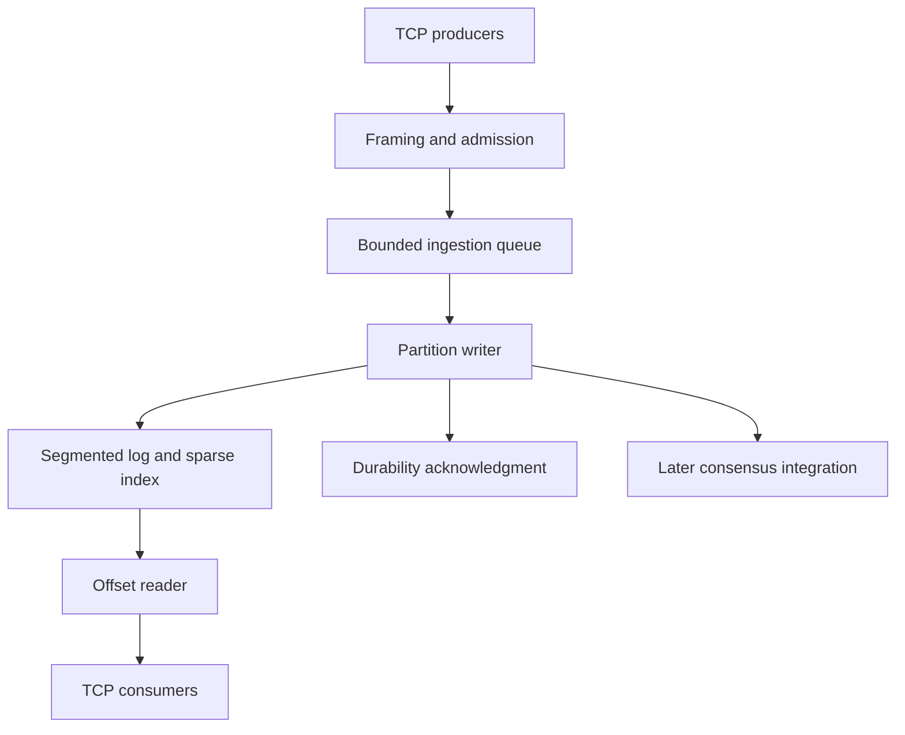

# KubeLog Engine

### An append-only storage engine with explicit durability and replicated-log recovery

KubeLog Engine proposes a compact storage system built around segmented binary logs, sparse offset indexes, bounded ingestion queues, and batched disk synchronization. The project asks: **how can a log sustain concurrent ingestion and efficient sequential reads while making ordering, acknowledgment, and recovery guarantees precise?**

**Status:** Project proposal and implementation plan. This repository currently contains documentation. Storage code, replication, deployment manifests, and benchmark results are planned; no durability or performance claims have been validated yet.

**Author:** Abhishek Patil

## At a glance

| Area | Proposed design |
|---|---|
| Storage layout | Versioned binary records in bounded log segments |
| Reads | Logical offsets, sparse indexes, and sequential scans |
| Ingestion | Concurrent clients feeding a bounded queue and one writer per partition |
| Durability | Explicit acknowledgment modes and configurable group commit |
| Replication | A later three-node, quorum-based log using an established consensus implementation |
| Performance study | Queueing, batch size, synchronization, indexing, and Linux `sendfile` |
| Initial implementation | Rust, TCP, Linux file I/O, and a reproducible local benchmark harness |

## Contents

- [Problem and scope](#problem-and-scope)
- [Architecture](#architecture)
- [Log format and indexing](#log-format-and-indexing)
- [Write path and acknowledgment semantics](#write-path-and-acknowledgment-semantics)
- [Read path and zero-copy study](#read-path-and-zero-copy-study)
- [Recovery and corruption handling](#recovery-and-corruption-handling)
- [Replication proposal](#replication-proposal)
- [Evaluation and fault injection](#evaluation-and-fault-injection)
- [Implementation milestones](#implementation-milestones)
- [Planned repository structure](#planned-repository-structure)
- [Limitations and references](#limitations-and-references)

## Problem and scope

An append-only log looks simple until the system must explain what happens between accepting a request and surviving a failure. A successful write to an operating-system buffer is different from durable storage. A replica receiving bytes is different from a committed record. An index can accelerate reads while also becoming stale after a crash.

KubeLog will make these boundaries explicit and test them before optimizing the data path. The target workload is immutable event records addressed by increasing offsets, with concurrent producers and sequential consumers. Example uses include replayable application events, telemetry streams, and change-log experiments.

The first implementation will be a **single-node Rust engine with one partition**. Rust is the primary implementation choice; a C++ rewrite is unnecessary unless a later comparison has a specific purpose. Additional partitions, replication, and Kubernetes packaging follow a correct local baseline.

This is a storage-engine project, not a claim to replace Kafka or provide a general database. Initial scope excludes SQL, cross-partition transactions, arbitrary record updates, tiered object storage, online cluster membership changes, and exactly-once application processing.

## Architecture

| Component | Responsibility |
|---|---|
| Network layer | Parse bounded frames, handle partial reads/writes, and apply connection backpressure |
| Ingestion queue | Bound admitted records and bytes while transferring ownership to the writer |
| Partition writer | Assign offsets, encode records, append batches, rotate segments, and advance durability state |
| Segment manager | Track active and sealed files and persist recoverable metadata |
| Sparse index | Locate a nearby byte position for a requested logical offset |
| Recovery scanner | Validate records and rebuild derived state after restart |
| Replication adapter | Integrate the storage contract with a selected consensus library in a later phase |

The first queue will use a straightforward bounded concurrent channel or mutex-protected structure. A ring buffer is a planned optimization to compare after profiling. The experiment must account for ownership, contention, memory use, and overload behavior; a more complicated queue is not automatically faster.

## Log format and indexing

### Record framing

Define a versioned format before writing performance code. Each record will contain a fixed header and a bounded payload. Proposed fields include a format marker, version, record length, logical offset, flags, and checksum. Producer identity and sequence fields may be added when retry deduplication is implemented.

Specify byte order, checksum coverage, valid length ranges, and how unknown versions are rejected. Validate lengths before allocation and checksum both the relevant header fields and payload. A checksum detects accidental corruption; it does not provide authentication or guarantee that a write reached durable media.

Offsets increase within a partition. They are logical record positions, not byte positions. The writer assigns them in append order, establishing a total order within that partition. Multiple partitions will not imply a global order.

### Segments

Each segment will have a base offset and a bounded target size. One segment is active for append; sealed segments are immutable. Rotation must preserve recovery information even if a crash occurs between creating the new segment and updating metadata.

The implementation will document which files and parent directories are synchronized during creation, rotation, and metadata replacement. Atomic rename can help publish a new manifest, but it does not by itself establish crash durability.

### Sparse offset index

Store an index entry every configured byte interval or record interval, mapping a logical offset to a file position. To read offset `o`, locate the greatest indexed offset no greater than `o`, then scan validated records until reaching the target.

The log is the source of truth. Indexes are rebuildable accelerators, and recovery must tolerate a missing, truncated, or stale index. Benchmark index density against memory consumption, rebuild time, and read amplification.

## Write path and acknowledgment semantics

### Ingestion and group commit

1. Parse a complete request and enforce maximum frame, record, queue-byte, and connection limits.
2. Admit the record to a bounded queue or return an explicit overload response.
3. Let the partition writer assign offsets and append an ordered batch, handling partial writes and interrupted system calls.
4. Synchronize according to the selected durability policy and advance the corresponding offset boundary.
5. Complete each request only when its requested acknowledgment condition has been met.

Group commit will be bounded by both batch size and maximum wait. It can amortize synchronization cost, but adds waiting time at low traffic and can worsen tail latency if poorly configured. Measure those effects instead of assuming a universal improvement.

Track separate boundaries for appended, locally durable, replicated, and committed data. A single ambiguous “written offset” is insufficient.

| Proposed acknowledgment mode | Success means | Failure exposure |
|---|---|---|
| `buffered` | The record has been appended through the operating-system write path | A crash or power loss may lose acknowledged data that was not synchronized |
| `local-durable` | Required log data and metadata have passed the specified local synchronization boundary | Does not protect against loss of the host or its storage device |
| `quorum-durable` — later | The record is committed by the consensus protocol and durably stored on a majority under the declared persistence contract | Availability requires a functioning majority; assumptions about storage behavior still apply |

The initial default will be `local-durable`. Queue admission alone will never be described as durable acceptance. Durability tests and benchmark charts will always name the acknowledgment mode.

### Proposed TCP operations

| Operation | Semantics |
|---|---|
| `Append` | Append one bounded record or bounded batch and return its assigned offsets after the requested acknowledgment boundary |
| `Read` | Read from an offset with an explicit maximum byte or record count |
| `Describe` | Return partition metadata and visible/durable boundaries |
| `Follow` — later | Wait for subsequent visible records with deadline and cancellation behavior |

The protocol will carry a version, request ID, operation, frame length, and structured error. It must handle split frames, short writes, slow consumers, invalid lengths, and clean shutdown without assuming that one TCP read equals one request.

Batch append will initially promise ordered records, not transactional all-or-nothing visibility. If a partial failure creates uncertainty about which records were appended, the response and retry contract must expose that uncertainty.

## Read path and zero-copy study

Use a buffered read-and-send implementation as the correctness baseline. Readers will locate the segment, consult its sparse index, validate boundaries, and stream a bounded response without holding the writer's critical section for the full transfer.

Linux `sendfile` is a later optimization for compatible transfers from immutable, sealed segments. It may reduce copying through application buffers when the wire representation matches the stored bytes. Small response headers can be sent separately, but partial transfers and socket backpressure still need handling.

**Zero-copy is conditional.** Decryption, transformation, per-record filtering, or TLS configurations may require a buffered path. The benchmark will state which path was used and compare CPU cost, throughput, and tail latency. It will not claim that data movement or disk I/O disappears.

Version one will not delete retained segments automatically. A later retention policy must coordinate reader references, index state, and replication/snapshot requirements before reclaiming files. Slow readers will have bounded buffers and explicit timeouts.

## Recovery and corruption handling

Restart will reconstruct the readable log from validated segment files rather than trusting cached offsets or indexes.

1. Discover segments and validate their headers, ordering, and metadata.
2. Scan the active tail and verify record lengths, offset continuity, and checksums.
3. Rebuild or reconcile sparse indexes and durable metadata as required.
4. Resolve incomplete tails according to the persistence contract before reopening writes.
5. Publish recovered boundaries and any detected integrity error in a structured recovery report.

A partial final record in an active single-node segment can be treated as an incomplete tail when recovery can establish that it is outside the protected durable prefix. Corruption within a sealed segment or known durable/committed prefix must fail recovery or enter an explicit repair workflow; it must not be silently skipped.

Durable boundary tracking itself needs a crash-consistent design. Where recovery cannot distinguish a torn uncommitted tail from damage to acknowledged data, it must report uncertainty rather than claim safe truncation. This is a design-review gate before publishing durability guarantees.

Disk-full conditions, synchronization errors, and failed rotations will place the affected writer into a failed or read-only state. It must not continue issuing durable acknowledgments after a failed synchronization. Recovery behavior and operator action will be documented for each error class.

## Replication proposal

Replication begins only after the single-node engine passes recovery tests. The initial topology will have three fixed members and one replicated partition. Use a vetted Raft implementation with a compatible persistent-storage interface; library selection and licensing are explicit design decisions to record before integration.

Do not add informal leader election around asynchronous log copying. The consensus integration must own terms, voting, conflicting suffix repair, and commit rules. The storage engine must satisfy that implementation's requirements for persisting entries and election state before sending dependent responses.

### Guarantees to establish

- Only the valid leader may accept writes for the current term; stale leaders cannot acknowledge quorum-durable progress.
- A successful quorum-durable append survives the supported single-node failure scenario and remains in the committed prefix after leader changes.
- A minority partition cannot commit new writes. Loss of quorum reduces availability rather than relaxing consistency.
- Followers reconcile conflicting uncommitted suffixes through the consensus protocol. Committed data is never discarded as ordinary tail cleanup.
- User-visible offsets are assigned through a deterministic replicated command or an equally well-specified mapping, rather than exposing every internal consensus entry as a user record.
- Initial reads are served by the leader using the selected library's leadership/read barrier mechanism. Follower reads, if added, will have explicitly weaker semantics unless equivalent coordination is implemented.

For retry deduplication, propose producer IDs plus monotonic sequence numbers and a persisted deduplication window. A lost response can otherwise cause a producer to append the same payload twice. Deduplication state must recover consistently with the records it protects. This provides a bounded retry contract, not exactly-once processing by downstream applications.

Snapshots, retention of consensus entries, membership changes, and multi-partition placement come later. The first experiment may retain the full log to keep the recovery model inspectable.

## Evaluation and fault injection

### Performance comparisons

| Question | Baseline | Comparison |
|---|---|---|
| Synchronization overhead | Synchronize each durable append | Size- and time-bounded group commit |
| Queue contention | Simple bounded queue | Ring buffer after profiling identifies contention |
| Index tradeoff | Sequential scan or coarse index | Several sparse-index densities |
| Read transfer cost | Buffered read and socket send | Eligible `sendfile` transfers |
| Replication cost | Local-durable single node | Quorum-durable three-node deployment |

Use multiple record sizes, producer counts, read/write mixes, queue limits, and offered loads. Fix acknowledgment semantics within a comparison. Do not present a buffered-write throughput improvement as evidence of faster durable storage.

Report records/second and bytes/second, P50/P95/P99 acknowledgment latency, queue dwell, synchronization latency, CPU use, memory, disk utilization, and recovery time. Separate page-cache-warm reads from cold or storage-limited conditions and document the method used to establish each condition.

For every benchmark, record CPU, RAM, filesystem, storage device, kernel, build configuration, dataset size, synchronization policy, and trial count. Use a load generator that records intended arrivals and backpressure so saturation cannot disappear from the results. Publish raw measurements and analysis scripts alongside conclusions.

### Correctness and failure tests

| Scenario | Required observation |
|---|---|
| Concurrent producers | Unique ordered offsets and payload integrity within each partition |
| Process termination during append | Recovery produces a valid prefix and respects the declared acknowledgment contract |
| Partial header or payload | Tail handling is deterministic; malformed lengths cannot cause unbounded allocation |
| Missing or corrupt index | Read correctness is restored by rebuilding from valid log records |
| Disk full or injected `fsync` error | No false durable acknowledgment; writer enters a documented failure state |
| Crash during segment rotation | File and metadata recovery follows the documented rotation protocol |
| Slow reader or producer flood | Memory remains bounded and backpressure is observable |
| Leader crash or network partition — later | Committed prefix is preserved, stale leadership is rejected, and minority writes do not commit |
| Lost append response — later | Retry behavior matches the documented producer sequence and retention rules |

Use deterministic failpoints around append, synchronization, index update, manifest publication, and acknowledgment. Record client-observed successes in an independent harness and compare them with recovered records.

A process kill is not a power-loss test: the operating system and storage device may continue flushing data afterward. Claims about power-loss behavior require an appropriate test environment and documented filesystem/device assumptions. Three containers on one host can test protocol behavior but do not model independent host or disk failures.

## Implementation milestones

| Phase | Deliverable | Exit criterion |
|---|---|---|
| 1. File format | Encoder, decoder, single segment, sequential reader | Round-trip and malformed-record tests establish format behavior |
| 2. Durable local log | Append, synchronization, restart scan | Acknowledgment and recovery boundaries pass deterministic failpoint tests |
| 3. Segments and indexes | Rotation, sparse lookup, index rebuild | Offset reads remain correct across rotation and restart |
| 4. Concurrent service | Bounded TCP protocol and ingestion queue | Concurrent clients preserve ordering and overload stays bounded |
| 5. Performance study | Group commit, queue comparison, eligible zero-copy reads | Reproducible measurements explain both throughput and latency costs |
| 6. Replication | Selected Raft library, three nodes, retry contract | Leader-failure and partition tests preserve committed history |
| 7. Packaging | Demo, results, operating notes, optional Kubernetes deployment | Another developer can reproduce recovery and one benchmark comparison |

Despite the project name, Kubernetes is not required for the first engine. A later deployment may use StatefulSets, persistent volumes, and placement constraints; those resources do not by themselves establish data durability or independent failure domains.

## Planned repository structure

Only this README exists at the proposal stage. Proposed implementation paths are:

| Path | Planned contents |
|---|---|
| `src/format/` | Record framing, versioning, and checksum handling |
| `src/storage/` | Segments, append writer, indexes, and recovery |
| `src/protocol/` | TCP framing and client/server operations |
| `src/replication/` | Later consensus and persistent-storage integration |
| `tests/` | Recovery, corruption, concurrency, and fault-injection scenarios |
| `benchmarks/` | Load generation, datasets, and analysis |
| `deploy/` | Local multi-node setup and later cluster manifests |
| `docs/` | Format specification, durability contract, and design decisions |

Build and run instructions will be added with the executable baseline. Proposed paths are a development plan, not an existing code inventory.

## Limitations and references

The main risks are incorrect persistence ordering, accidental acknowledgment before durability, unsafe tail repair, and replication integration that violates the consensus library's storage contract. These risks define the first correctness gates. Optimization follows a recoverable baseline.

The project uses established log-storage and consensus ideas. Its intended contribution is an understandable implementation, explicit contracts, and measurements showing how batching, indexing, transfer paths, and replication interact.

- [Linux `fsync(2)`](https://man7.org/linux/man-pages/man2/fsync.2.html) — file synchronization, error handling, and directory persistence considerations.
- [Linux `sendfile(2)`](https://man7.org/linux/man-pages/man2/sendfile.2.html) — file-to-descriptor transfers and their constraints.
- [Raft: In Search of an Understandable Consensus Algorithm](https://raft.github.io/raft.pdf) — leader election, replicated logs, persistence, and safety rules.
- [Raft project resources](https://raft.github.io/) — implementation and consensus background to inform the later library selection.
