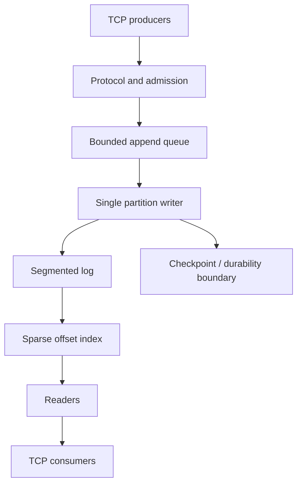

# KubeLog Engine

KubeLog is a compact append-only storage engine focused on making ordering, durability, recovery, and backpressure explicit rather than hiding them behind a large framework.

## Status

Runnable single-node Rust prototype. The repository currently implements:

- versioned binary records with CRC validation
- segmented append-only log files
- checksummed persistent checkpoints
- restart scanning and tail recovery
- sparse offset indexes rebuilt from the log
- bounded concurrent append admission with a single writer
- TCP `Append`, `Read`, and `Describe` operations
- segment rotation and cross-segment reads
- corruption, restart, concurrency, and protocol tests

Planned work includes group commit benchmarking, broader crash/fault injection, zero-copy read experiments, replication, and Kubernetes packaging. Process-crash behavior is not presented as evidence of power-loss durability.

## Architecture



The writer is the only owner of append order and offset assignment. The log is the source of truth; the sparse index is rebuildable derived state. A successful local append synchronizes the record and publishes a checksummed checkpoint before returning success.

## Run locally

Requires Rust 1.98.1 on Linux.

```bash
cargo run -- init ./kubelog-data
cargo run -- serve ./kubelog-data
```

In another terminal:

```bash
python3 examples/demo.py
```

Stop the server and restart it with the same data directory to verify recovery:

```bash
cargo run -- serve ./kubelog-data
```

Run the checks with:

```bash
cargo fmt --check
cargo check
cargo test
```

## Repository layout

```text
src/
  format.rs    record, segment, and checkpoint encoding
  storage.rs   append, rotation, sparse indexes, recovery
  engine.rs    bounded admission and writer ownership
  server.rs    TCP framing and request handling
  main.rs      init / serve process wiring

tests/
  format.rs
  storage.rs
  rotation.rs
  engine.rs
  network.rs

examples/
  demo.py
```

## Current limits

The service binds to loopback by default and has no authentication or TLS. Records are capped at 1 MiB, connections at 32, queued append work at 1,024 items / 16 MiB of payload, and storage at 64 segments of 64 MiB in the baseline configuration. Reads currently share the store mutex while scanning, so slow storage reads can delay the writer.

A lost or timed-out append response may have an unknown outcome; retry deduplication is not implemented yet. Replication and quorum durability are roadmap items rather than current guarantees.

## Design direction

The next performance work is to compare the correctness baseline against size/time-bounded group commit, alternative queue designs where profiling justifies them, and eligible Linux zero-copy reads. Distributed work comes only after the local persistence contract is validated; the intended direction is a three-node consensus-backed replicated log rather than ad-hoc asynchronous copying.

The project is intentionally scoped as a systems-learning implementation, not a claim to replace Kafka or a general-purpose database.
